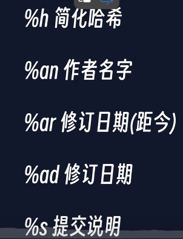
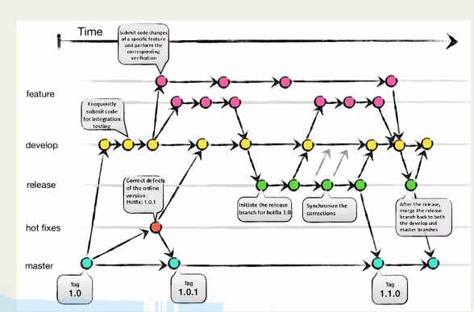

# Git 学习
## 1. 创建仓库 
### 本地创建
```
git init
```
### 或者从代码库拉取下来
```
git clone
```
## 2. git文件状态和提交版本

```
git commit -m '备注信息'
```
### 撤销提交
```
git reset head~ --soft
```
## 3. 查询文件状态
```
git status
```
## 4.查询提交内容的不同
```
git diff
```
## 5.查询历史提交
```
git log
```
### 美化输出
```
git log --pretty=oneline
git log --pretty=format:"%h-%an,%ar:%s"
```

### 图形化输出
```
git log --graph
```
## 6.远程仓库-github.com
### 创建远程仓库
### access—token获取，鉴权
```
git remote
git push orgin master
```
## 7.git 分支

### 查看当前分支
```
git status
或者
git branch --list
```
## 8.创建分支
```
git branch feature1
```
### 切换到相应分支
```
git checkout feature1
```


